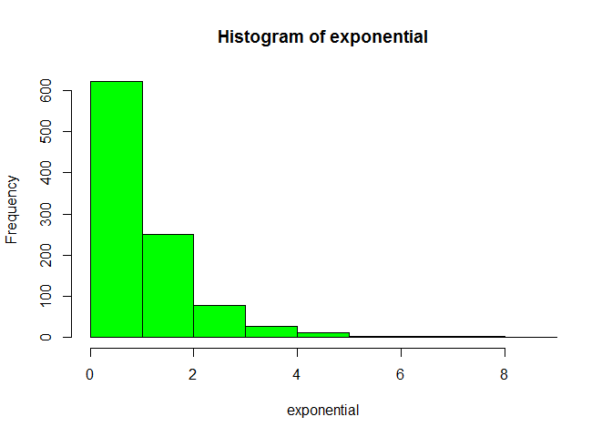
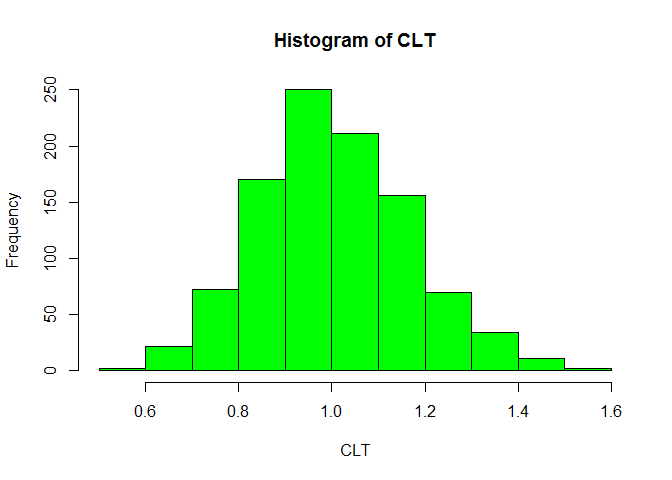

# Central Limit Theorem
Cody Frisby  
September 17, 2015  
Here's some R code to simulate the Central Limit Theorem

This first block of code simulates 1000 random samples from a standard exponential
distribution.  Then we look at the mean.

```r
exponential <- rexp(1000)
mean(exponential)
```

```
## [1] 1.006627
```
The next step we are going to take 1000 samples of size 40 from our exponential data
and then take the mean of each sample.  So in all we will have 1000 means 
of size n=40.  Then we look at the mean.

```r
CLT <- NULL
for (i in 1 : 1000) CLT <- c(CLT, mean(sample(exponential, 40)))
mean(CLT)
```

```
## [1] 1.005537
```

Now let's look at the shape of the piles of these two distributions.

  

Observe how the CLT histogram appears normally distributed.
