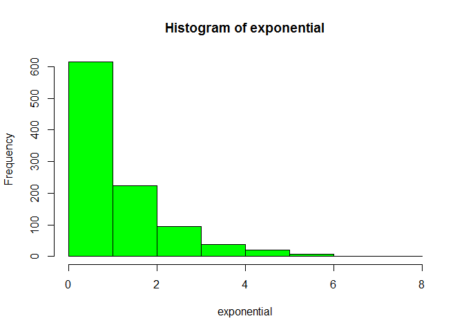
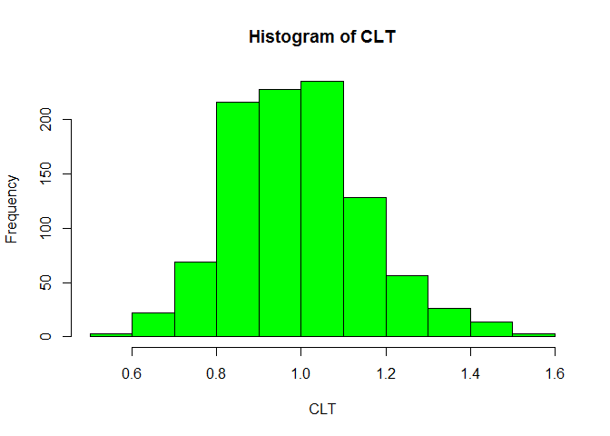

# Central Limit Therom
Cody Frisby  
September 17, 2015  


```r
exponential <- rexp(1000)
CLT <- NULL
for (i in 1 : 1000) CLT <- c(CLT, mean(rexp(40)))
mean(exponential)
```

```
## [1] 1.056758
```

```r
mean(CLT)
```

```
## [1] 0.9928821
```

Here's are the histograms of the two distributions:

  
